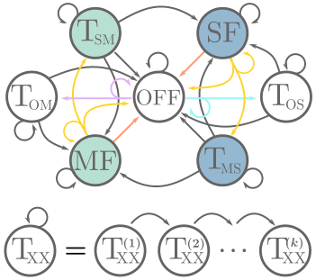

# Dual-Fuel Units

## Description

    pmin::Real
    pmax::Real
    p::Real
    fuel_input::Function
    trans_steps::Int
    start_steps::Int
    cost::Dict{Symbol, Any}
    prob::Dict{Symbol, Any}
    pressure_out::Real
    gas_loc::Union{Int, Nothing}
    pwr_bus::Int
    status::Symbol
    state2int::Dict{Symbol, Int}
    int2state::Dict{Int, Symbol}
    act2int::Dict{Symbol, Int}
    int2act::Dict{Int, Symbol}

## Actions

